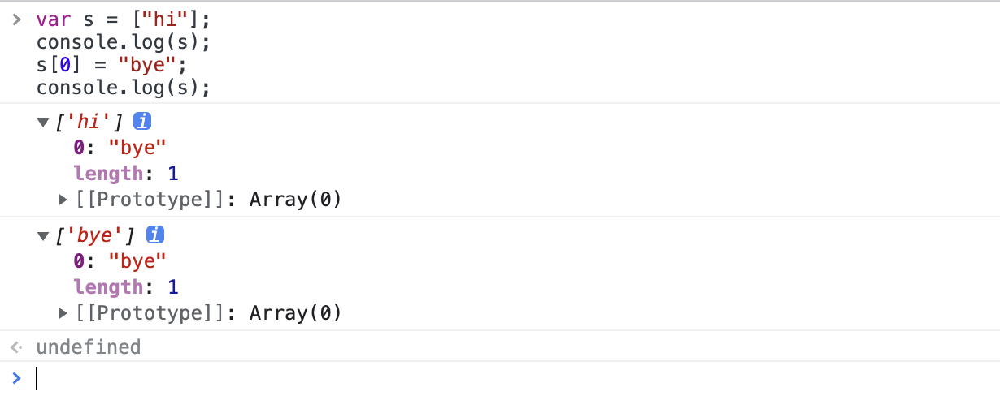

在浏览器的 DevTool 的 Console 模块中，所有输出的值都是引用，只有在**展开**的时候才会被惰性求值，显示当前的值

```js
var s = ["hi"];
console.log(s);
s[0] = "bye";
console.log(s);
```



如果已经展开了的话，此时展示的值就是一层**浅拷贝**了，再修改 s 的元素不会对他产生影响

既然是浅拷贝，那修改 s 内部的引用仍然会改变展开后的结果。


link:

[Is Chrome’s JavaScript console lazy about evaluating objects? - Stack Overflow](https://stackoverflow.com/questions/4057440/is-chrome-s-javascript-console-lazy-about-evaluating-objects)