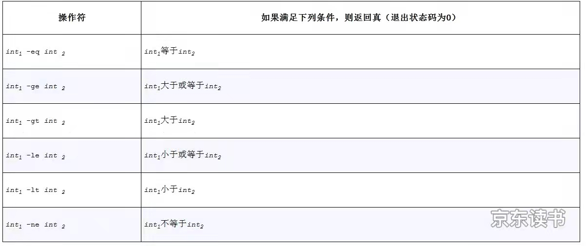

# 条件语句

```shell
if command
	then
		# code
	else
		# code
fi
```

commad 是要执行的命令，如果退出状态为0 (正常退出)，执行then 后命令


## test 或者 [ expressioin ]

```shell
test expression
```

如果 expression 求值为真，则退出状态码为0

`[ expressioin ]` 是 test 的另一种等价写法,，两侧有空格，`[` 被识别为命令（或者说程序）

```shell
$ a=str
$ test "$a" = str # "$a" = str 是test 的三个参数
$ echo $? # 上一个命令执行结果
```


### test 字符串操作符


### test 数字操作符




### test 文件操作符


| 操作符    | 如果满足下述条件，则返回真（退出状态码为0） |
| --------- | ------------------------------------------- |
| -a *file* | *file* 是一个目录                           |
| -e *file* | *file* 存在                                 |
| -f *file* | *file* 是普通文件                           |


## 组合

上面的表达式被称为 primaries

   These primaries can be combined with the following operators:


   **!** expression True if expression is false.


   expression1 **-a** expression2

​          True if both expression1 and expression2 are true.


   expression1 **-o** expression2

​          True if either expression1 or expression2 are true.


   **(** expression **)**

​          True if expression is true.

`(` 需要转义

```shell
sh-3.2$ count=3
sh-3.2$ [ \( "$count" -ge 0 \) -a \( "$count" -lt 10 \) ]
sh-3.2$ echo $?
0

```


## case 命令

```shell
# 将数字转换为对应单词
if [ "$#" -ne 1 ]
then 
  echo "wrong parameters"
  exit 1
fi

case "$1"
in 
  0) echo zero;;
  1) echo one;;
esac

```

```shell
# 判断输入字符类型 校验特殊情况 参数 是否为单个字符
if [ $# -ne 1 ] 
then 
  echo error parameter
fi

charnum=$(echo "$1" | wc -c)
if [ charnum -ne 2 ] # echo 返回一个换行字符
then 
  echo Please type single character
fi

char=$1
case "$char"
in
 [0-9])echo digits;;
 [a-zA-z])echo alpha;;
 ?)echo special character;;
 *)echo Please type single character;;
esac

```


## && and ||